# (PART) 网络分析 {-}


# Network Analysis in R {#1}

## Basic Concepts and Applications {#1a}


### Basic Concepts about Graph {#1a1}
- vertex(or node)
- edge
- direct or undirect graph
This course is using **igraph** for working with network data and network visualizing.

**For creating an igraph object** , you can use `graph.edgelist()` ,but remember convert data to matrix form. The position of the nodes and edges of the graph **is not important** (for now), what is important is the relationship between each node. 

Another function to create an igraph object is `graph_from_data_frame()`. Two data frames need to be provided - one contains all edges in the network with attributes and one all vertices in the network.

- `V()`: returns all vertices in a network.
- `E()`: returns all edges.
- `gorder()` : returns number of vertices.
- `gsize()` : returns number of edges.


```r
# Create an igraph object, first you need to convert data to matrix form
friends.mat <- as.matrix(friends)

# Convert friends matrix to an igraph object
g <- graph.edgelist(friends.mat, directed = FALSE)

# Another way to create igraph object
g1 <- graph_from_data_frame(d = friends.edges, vertices = friends.nodes, directed = FALSE)

# Subset vertices and edges
V(g)
## + 16/16 vertices, named, from f064c29:
##  [1] Jessie  Sidney  Britt   Donnie  Karl    Berry   Rene    Shayne  Elisha 
## [10] Whitney Odell   Lacy    Eugene  Jude    Rickie  Tommy
E(g)
## + 27/27 edges from f064c29 (vertex names):
##  [1] Jessie --Sidney  Jessie --Britt   Sidney --Britt   Sidney --Donnie 
##  [5] Karl   --Berry   Sidney --Rene    Britt  --Rene    Sidney --Shayne 
##  [9] Sidney --Elisha  Sidney --Whitney Jessie --Whitney Donnie --Odell  
## [13] Sidney --Odell   Rene   --Whitney Donnie --Shayne  Jessie --Lacy   
## [17] Rene   --Lacy    Elisha --Eugene  Eugene --Jude    Berry  --Odell  
## [21] Odell  --Rickie  Karl   --Odell   Britt  --Lacy    Elisha --Jude   
## [25] Whitney--Lacy    Britt  --Whitney Karl   --Tommy

gorder(g) # as as vcount(g)
## [1] 16
gsize(g)
## [1] 27
```


```r
# Make a very basic plot of the network
plot(g)
```

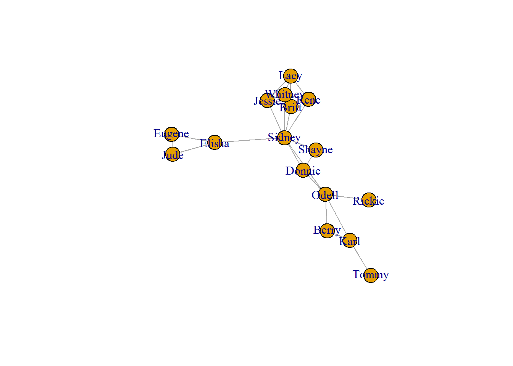


### Add and Visualizing attributes {#1a2}

Vertices and edges could have attributes.
- `set_vertex_attr()` : add attributes to vertices.
- `set_edge_attr()` : add attributes to edges.


You can use `V()`  to view attributes of vertices in a dataframe.

When attributes are added, something interesting is about to begin . You can subset vertices and edges by specific conditions or delete them.


```r
# suppose you have three attributes
genders <- friends.nodes$gender
ages <- sample(18:23, size = 16, replace = TRUE)
hours <- friends.edges$hours


# Create new vertex attributes called 'gender' and 'age'
g <- set_vertex_attr(g, "gender", value = genders)
## Warning in vattrs[[name]][index] <- value: number of items to replace is not a
## multiple of replacement length
g <- set_vertex_attr(g, "age", value = ages)

# Create new edge attribute called 'hours'
g <- set_edge_attr(g, 'hours', value = hours)
## Warning in eattrs[[name]][index] <- value: number of items to replace is not a
## multiple of replacement length

# View all vertex and edge attributes  in a list
vertex_attr(g)
## $name
##  [1] "Jessie"  "Sidney"  "Britt"   "Donnie"  "Karl"    "Berry"   "Rene"   
##  [8] "Shayne"  "Elisha"  "Whitney" "Odell"   "Lacy"    "Eugene"  "Jude"   
## [15] "Rickie"  "Tommy"  
## 
## $gender
##  [1] "M" "F" "F" "M" "M" "F" "M" "F" "M" "F" "F" "M" "M" "M" "M" "M"
## 
## $age
##  [1] 21 21 19 21 20 19 21 23 20 22 21 20 21 23 20 18
edge_attr(g)
## $hours
##  [1] 1 3 2 3 5 1 3 5 2 1 3 5 3 2 6 1 2 2 1 1 2 1 1 3 2 1 3

# Find edges with conditions, this grammar is like the way Python takes a subset

# V(g)[[age == 22]] 
# E(g)[[inc('Lacy')]]  
# E(g)[[hours>=3]]  

# Delete edges and vertices
g1_1 <- delete_edges(g1, E(g1)[hours < 2])
g1_2 <- delete_vertices(g, V(g)[[age <20]])
```


```r
# Visualizing attributes
paste("This graph tells me that boys prefer to make friends and their relationship graph is more aggregated")
```

```
## [1] "This graph tells me that boys prefer to make friends and their relationship graph is more aggregated"
```

```r
# Set vertex color by gender
V(g1)$color <- ifelse(V(g1)$gender == "F", "orange", "#24addb")

# Plot the graph
plot(g1, vertex.label.color = "black")
```

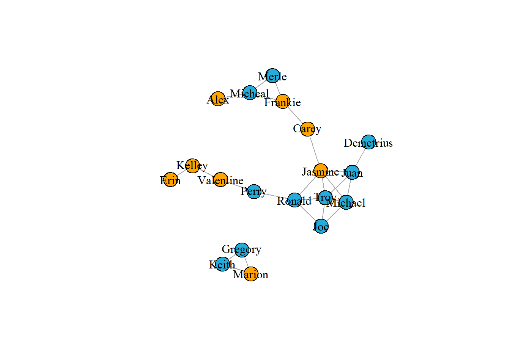


### Network Visualization {#1a3}

The most effective network visualizations should **immediately provide insight and understanding** to the viewer. These styles below can be done separately or in conjunction with each other.


Vertices Style
- size
- labels
- color
- shape


Edges Style
- color
- line type

---
Appropriate Layout
- Minimize edge crossing
- Do not allow vertices to overlap
- Make edge lengths as uniform as possible
- Increase symmetry of the network as much as possible
- **Position more influential nodes towards the center**


In the `plot()` function, change the layout argument to produce different graph layout. Choosing a correct layout can be bewildering. Fortunately igraph has a function `layout_nicely()` that tries to choose the most appropriate layout function for a given graph object. 

- circle 
	- 	`layout_in_circle()`
- fruchterman-reingold: 
	- `layout_with_fr()`, [details on Wiki](https://en.wikipedia.org/wiki/Force-directed_graph_drawing)
- kamada-kawai: 
	- `layout_with_fr()`
- grid: 
	- `layout_on_grid()`
- lgl: 
	- `layout_with_lgl()`
- tree: 
	- `layout_as_tree()`
(For more layouts see the manual on [igraph website](https://igraph.org/r/doc/layout_.html))

You can also stipulate the layout **by providing a matrix of (x, y) coordinates for each vertex**.
Here you use the `layout_as_tree()` function to generate the matrix m of coordinates. Then pass m to the layout function in plot() to plot.


```r
# Visualization in layout
plot(g1, vertex.label.color = "black", layout = layout_in_circle(g1))
```

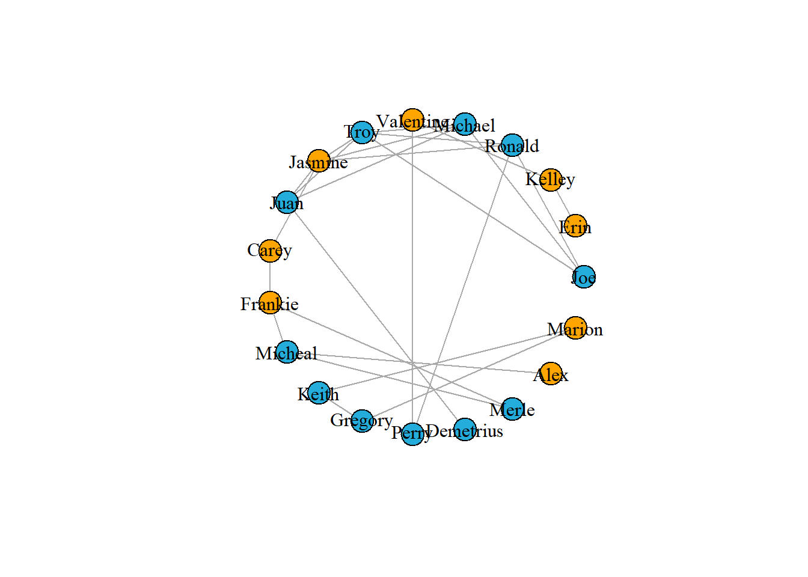

```r
plot(g1, vertex.label.color = "black", layout = layout_with_fr(g1))
```

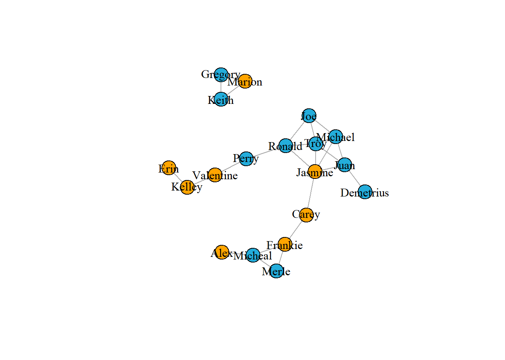

```r
m <- layout_as_tree(g1)
plot(g1, vertex.label.color = "black", layout =  m)
```

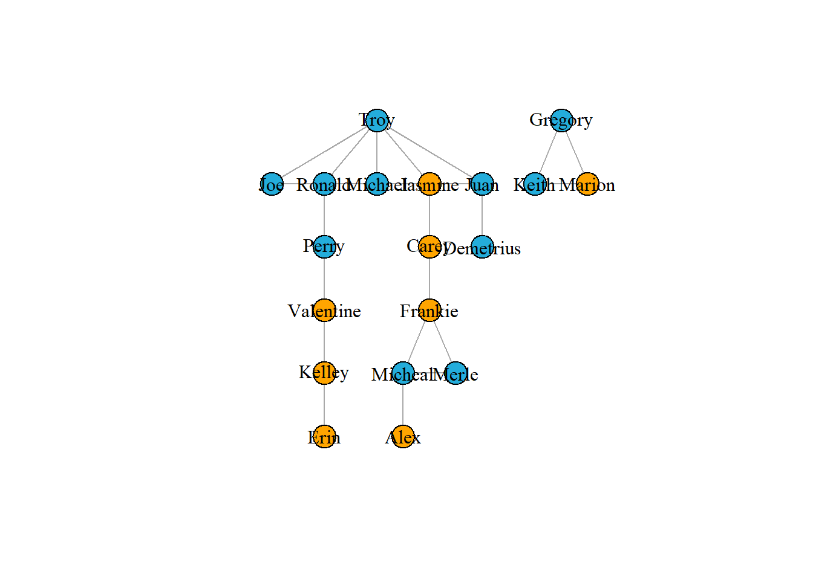

```r
m1 <- layout_nicely(g1)
plot(g1, vertex.label.color = "black", layout = m1)
```

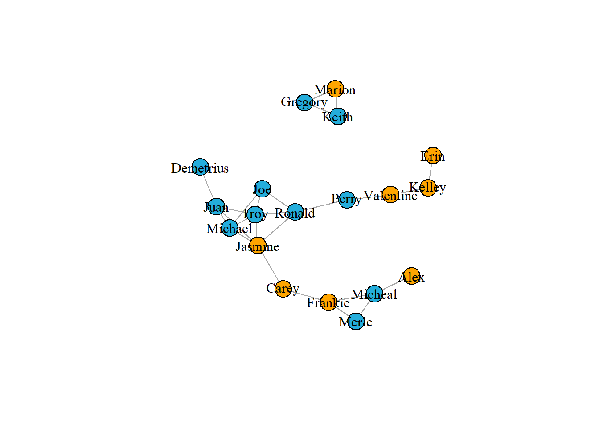

```r
# Visualiztion in edges

# Create a vector of weights based on the number of hours each pair spend together
w1 <- E(g1)$hours

# Plot the network varying edges by weights
m1 <- layout_nicely(g1)
plot(g1, 
        vertex.label.color = "black", 
        edge.color = 'black',
        edge.width = w1,
        layout = m1)
```

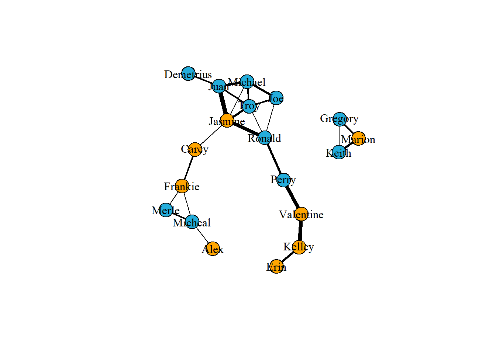

## Directed networks {#1b}

### Basic Concepts {#1b1}

- head -> tail

The edges in undirected networks simply indicate that a relationship of some kind exists between two vertices. However, in many networks edges do have directionality. In such directed networks, an arrow represent an edge going from one vertex to another vertex. 

Subset each vertex from which each edge originates by using `head_of()`. This function takes two arguments, the first being the graph object and the second the edges to examine. For all edges you can use E(g)

**The example network** you will use is of a severe measles outbreak that spread through the town of Hagelloch, Germany, in 1861, affecting 188 children. Each edge represents the transmission of measles from one individual to the next.


```r
# Get the graph object
g2 <- graph_from_data_frame(measles, directed = TRUE)

# is the graph directed?
is.directed(g2)
```

```
## [1] TRUE
```

```r
# Where does each edge originate from? But I don't understand the result ...
# table(head_of(g2, E(g2)))

plot(g2, 
     vertex.label.color = "black", 
     edge.color = 'gray77',
     vertex.size = 0,
     edge.arrow.size = 0.1,
     layout = layout_nicely(g2))
```

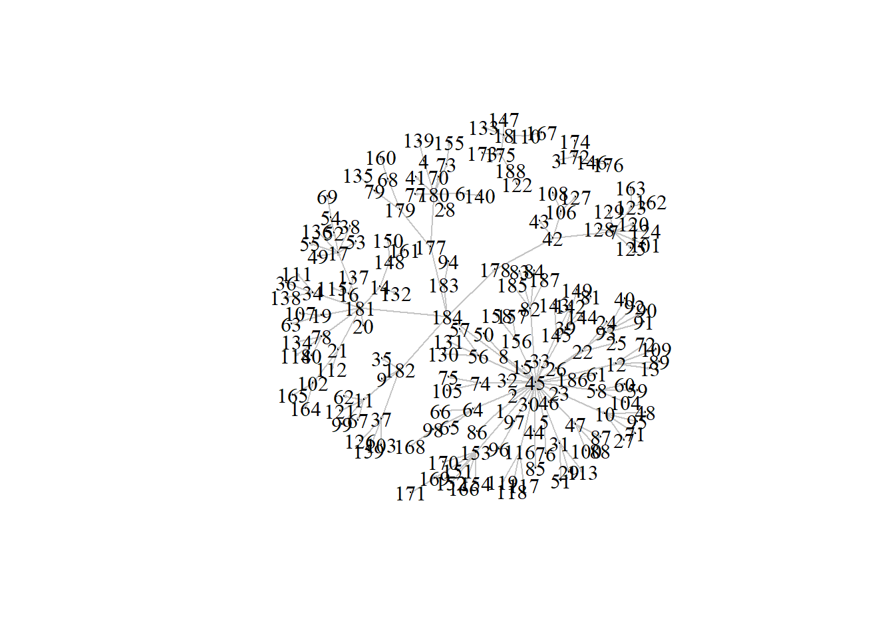


### Relationships between edges {#1b2}

Check if there is an edge going in each direction between vertex 184 to vertex 178 using single brackets subsetting of the graph object. 

Using the function `incident()` identify those edges that go in either direction from vertex 184 or only those going out from vertex 184. Choose `mode` from all, in and out.


```r
# Is there an edge going from vertex 184 to vertex 178?
g2['184', '178']
## [1] 1

# Is there an edge going from vertex 178 to vertex 184?
g2['178', '184']
## [1] 0

# Show all edges going to or from vertex 184
incident(g2, '184', mode = c("all"))
## + 6/184 edges from f0df7cd (vertex names):
## [1] 184->45  184->182 184->181 184->178 184->183 184->177

# Show all edges going out from vertex 184
incident(g2, '184', mode = c("out"))
## + 6/184 edges from f0df7cd (vertex names):
## [1] 184->45  184->182 184->181 184->178 184->183 184->177
```


### Relationships between vertices {#1b3}

- `neighbors()`: A vertex is a neighbor of another one (in other words, the two vertices are adjacent), if they are incident to the same edge.
	- `intersection()`: to identify if there are any vertices that exist in both neighbors1 and neighbors1. 

A path is simply the chain of connections between vertices. The number of intervening edges between two vertices represents the [geodesic distance](https://en.wikipedia.org/wiki/Distance_(graph_theory)) between vertices. 

- `farthest_vertices()`: Find the length of the longest path in the network(Sometimes it can be more than one).
- `get_diameter()` :  Identify the sequence of the path.
- `ego()`: Find the vertices not farther than a given limit from another fixed vertex, these are called the neighborhood of the vertex.


```r
# Identify neighbors of vertex 10 in specific mode
neighbors(g2, '10', mode = c('all'))
## + 5/187 vertices, named, from f0df7cd:
## [1] 45 27 48 71 95

neighbors(g2, '10', mode = c('in'))
## + 1/187 vertex, named, from f0df7cd:
## [1] 45

# Identify any vertices that receive an edge from vertex 42 and direct an edge to vertex 124
n1 <- neighbors(g2, '42', mode = c('out'))
n2 <- neighbors(g2, '124', mode = c('in'))
intersection(n1, n2)
## + 1/187 vertex, named, from f0df7cd:
## [1] 7


# distance between two vertices
farthest_vertices(g2)
## $vertices
## + 2/187 vertices, named, from f0df7cd:
## [1] 184 162
## 
## $distance
## [1] 5

get_diameter(g2)
## + 6/187 vertices, named, from f0df7cd:
## [1] 184 178 42  7   123 162

ego(g2, 2, '10', mode = c('out'))
## [[1]]
## + 5/187 vertices, named, from f0df7cd:
## [1] 10 27 48 71 95
```


### Identifying key vertices {#1b4}

Measurement metrics:
- in degree
- out degree
- Betweenness


Betweenness is an index of how frequently the vertex lies on shortest paths between any two vertices in the network. It can be thought of as how critical the vertex is to the flow of information through a network.


```r
# Calculate the out-degree of each vertex
g.outd <- degree(g2, mode = c("out"))


table(g.outd)
## g.outd
##   0   1   2   3   4   6   7   8  30 
## 125  21  16  12   6   2   3   1   1

# Make a histogram of out-degrees
hist(g.outd, breaks = 30)
```

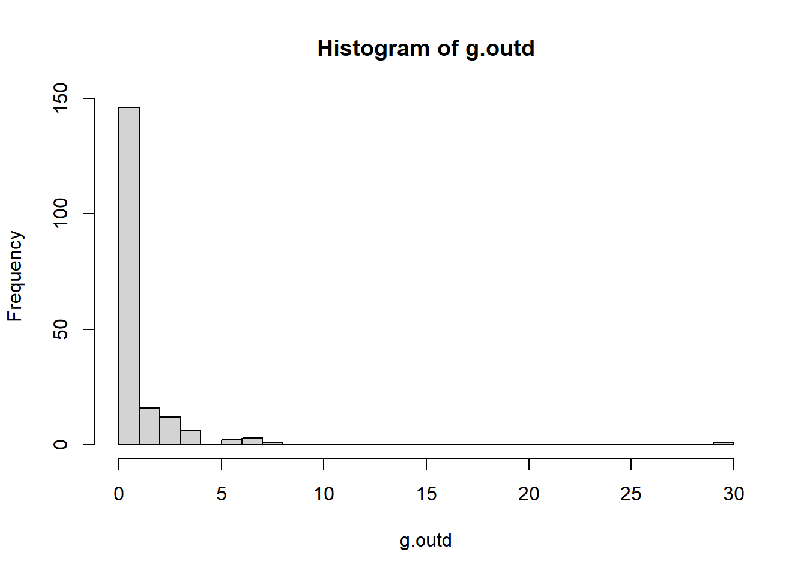

```r

# Find the vertex that has the maximum out-degree
which.max(g.outd)
## 45 
##  1

plot(g2, 
     vertex.label = NA,
     edge.color = 'black',
     vertex.size = sqrt(g.outd)+1,
     edge.arrow.size = 0.05,
     layout = layout_nicely(g2))
```

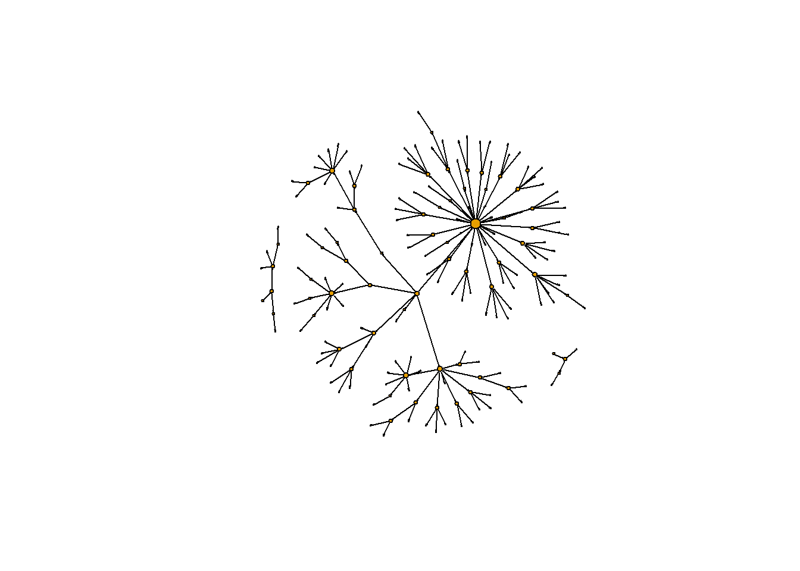

```r

# Calculate betweenness of each vertex
g.b <- betweenness(g2, directed = TRUE)

hist(g.b, breaks = 80)
```

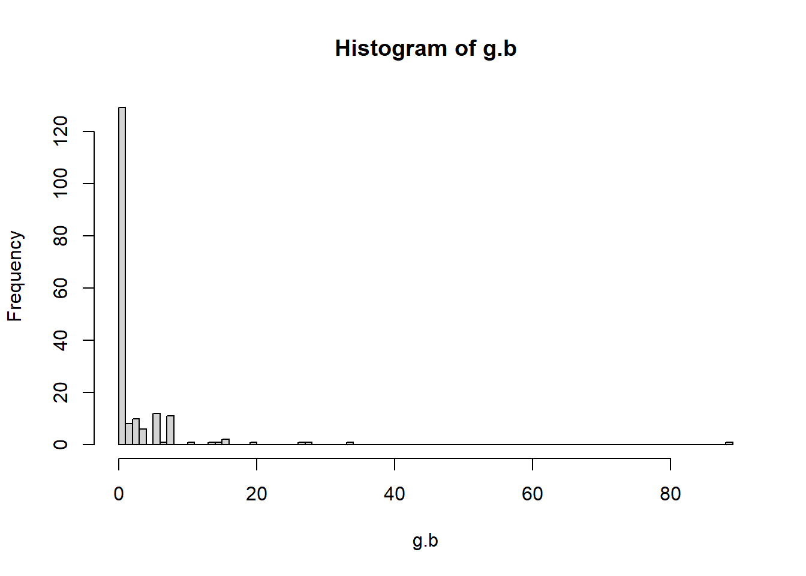

```r

# Create plot with vertex size determined by betweenness score
plot(g2, 
     vertex.label = NA,
     edge.color = 'black',
     vertex.size = sqrt(g.b)+1,
     edge.arrow.size = 0.05,
     layout = layout_nicely(g2))
```

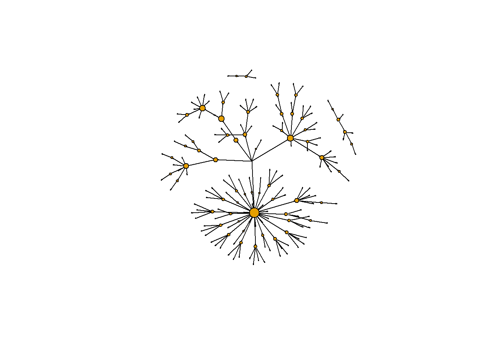


`make_ego_graph()` : Create a subset of our network comprised of vertices that are connected to fixed vertex , the first argument is the original graph g, the second argument is the maximal number of connections that any vertex needs to be connected to our vertex of interest. 

One issue with the measles dataset is that there are three individuals for whom no information is known about who infected them. One of these individuals (vertex 184) appears ultimately responsible for spreading the disease to many other individuals even though they did not directly infect too many individuals. (This entire paragraph is excerpted from the course)

However, because vertex 184 has no incoming edge in the network they appear to have low betweenness. One way to explore the importance of this vertex is by visualizing the geodesic distances of connections going out from this individual. In this exercise you shall create a plot of these distances from this patient zero. (This entire paragraph is excerpted from the course)


```r
# Make an ego graph
g184 <- make_ego_graph(g2, diameter(g2), nodes = '184', mode = c("all"))[[1]]

# Get a vector of geodesic distances of all vertices from vertex 184 
dists <- distances(g184, "184")

# Create a color palette of length equal to the maximal geodesic distance plus one.
colors <- c("black", "red", "orange", "blue", "dodgerblue", "cyan")

# Set color attribute to vertices of network g184.
V(g184)$color <- colors[dists+1]

# Visualize the network based on geodesic distance from vertex 184 (patient zero).
plot(g184, 
     vertex.label = dists, 
     vertex.label.color = "white",
     vertex.label.cex = .6,
     edge.color = 'black',
     vertex.size = 7,
     edge.arrow.size = .05,
     main = "Geodesic Distances from Patient Zero"
     )
```

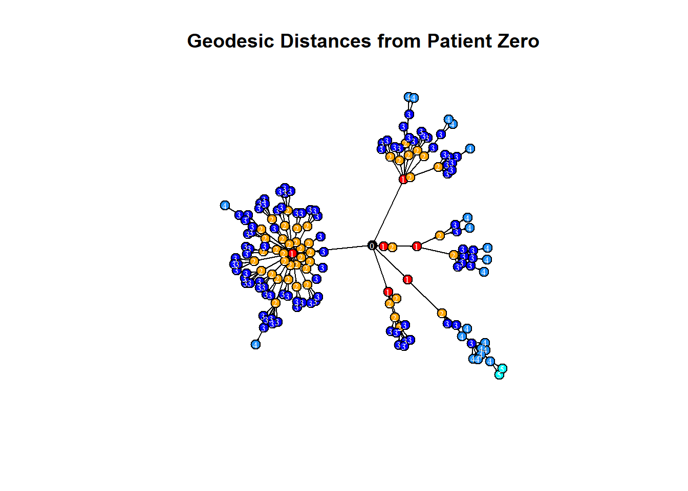

## Network Structure {#1c}

### Basic Structure metrics {#1c1}
- `eigen_centrality()` : takes a graph (graph) and returns the eigenvector [centralities of positions](https://en.wikipedia.org/wiki/Eigenvector_centrality) v within it

You will use a social network based on the movie Forrest Gump. Each edge of the network indicates that those two characters were in at least one scene of the movie together. Therefore this network is undirected. 


```r
# Make an undirected network
g3 <- graph_from_data_frame(gump, directed = FALSE)

# Identify key nodes using eigenvector centrality
g.ec <- eigen_centrality(g3)
which.max(g.ec$vector)
## FORREST 
##      36

# Plot Forrest Gump Network
plot(g3,
vertex.label.color = "black", 
vertex.label.cex = 0.6,
vertex.size = 25*(g.ec$vector),
edge.color = 'gray88',
main = "Forrest Gump Network"
)
```

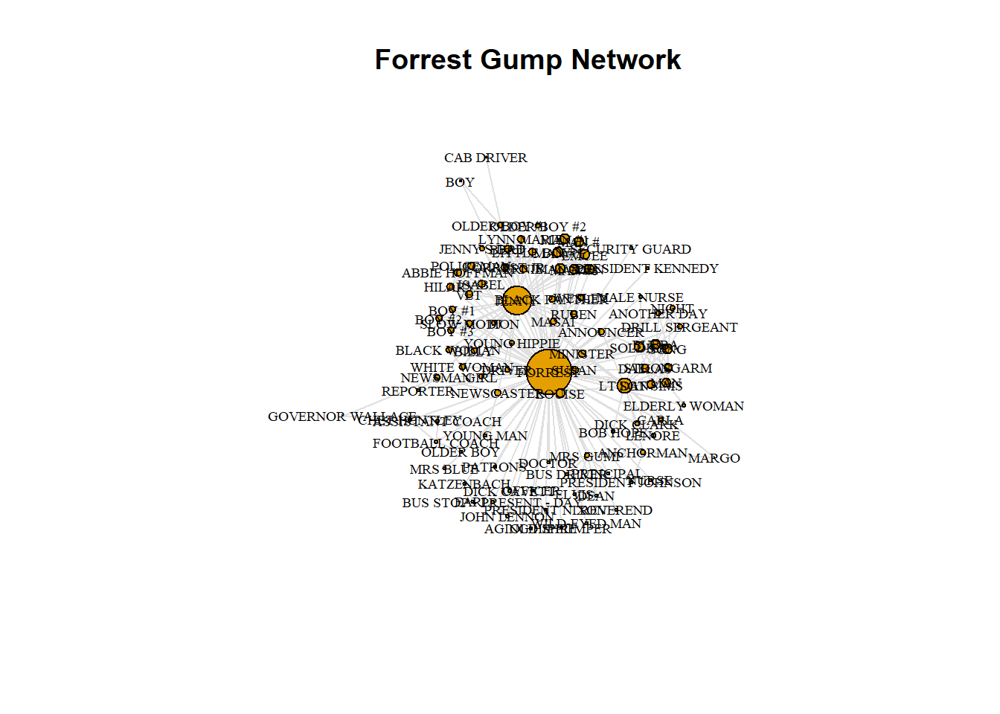


- `edge_density()` : calculate the edge density of the graph
- `mean_distance()` : calculate the average path length of the graph


```r
# Get density of a graph
gd <- edge_density(g3)

# The diameter of a graph is the length of the longest geodesic.
diameter(g3, directed = FALSE)
## [1] 4

# Get the average path length of the graph g
g.apl <- mean_distance(g3, directed = FALSE)
g.apl
## [1] 1.994967
```


### Random graphs {#1c2}

Generating [random graphs](https://en.wikipedia.org/wiki/Random_graph) is an important method for investigating how likely or unlikely other network metrics are likely to occur given certain properties of the original graph. 

The simplest random graph is one that has **the same number of vertices** as your original graph and approximately **the same density** as the original graph.(This entire paragraph is excerpted from the course)

`erdos.renyi.game()` : generate random graphs according to the [Erdos-Renyi model](https://en.wikipedia.org/wiki/Erd%C5%91s%E2%80%93R%C3%A9nyi_model), more function details on [igraph](https://igraph.org/r/html/latest/erdos.renyi.game.html).


```r
g.random <- erdos.renyi.game(n = gorder(g3), p.or.m = gd, type = "gnp")

plot(g.random, 
    vertex.label = NA,
    vertex.size = 1,
    )
```

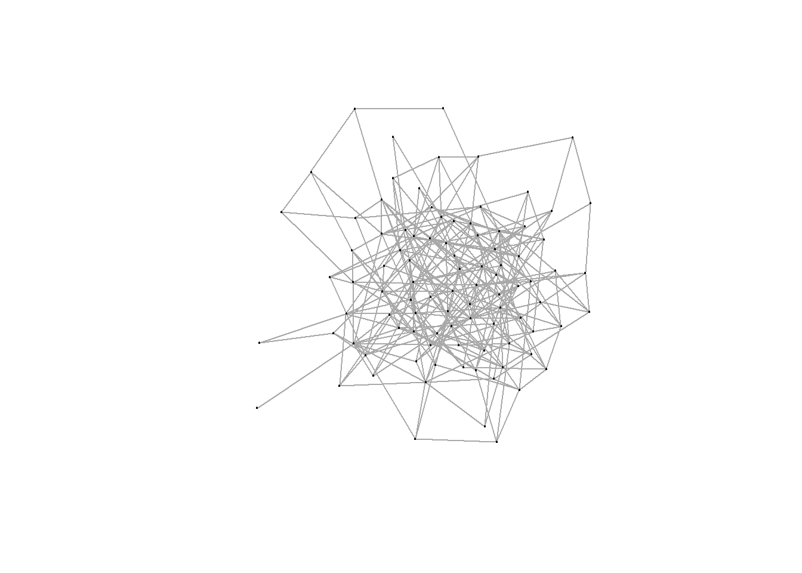

```r

# Get density of new random graph `g.random`
edge_density(g.random)
## [1] 0.06634637

# Get the average path length of the random graph g.random
mean_distance(g.random, directed = FALSE)
## [1] 2.673073
```


### Randomization test {#1c3}

The Forrest Gump network was smaller than the average path length of the random network, you can more formally address this by creating 1000 random graphs based on the number of vertices and density of the original Forrest Gump graph. Then, you can see how many times the average path length of the random graphs is less than the original Forrest Gump network. This is called a randomization test.(This entire paragraph is excerpted from the course)

**Conclusion** : the Forrest Gump network is far more interconnected than we would expect by chance.


```r
# Generate 1000 random graphs
gl <- vector('list', 1000)
  
for(i in 1:1000){
  gl[[i]] <- erdos.renyi.game(n = gorder(g3), p.or.m = gd, type = "gnp")
}

# Calculate average path length of 1000 random graphs
gl.apls <- unlist(lapply(gl, mean_distance, directed = FALSE))

# Plot the distribution of average path lengths
hist(gl.apls, xlim = range(c(1.5, 6)), breaks = 5)
abline(v = mean_distance(g3,directed=FALSE), col = "red", lty = 3, lwd = 2)
```

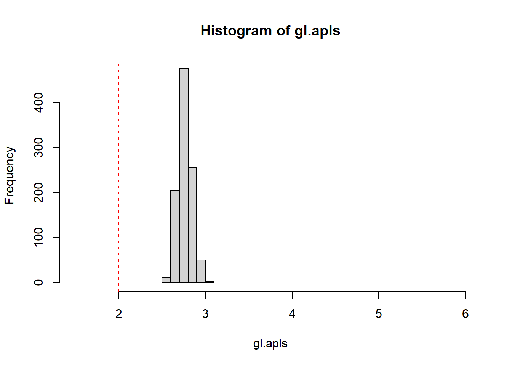

```r

# Calculate the proportion of graphs with an average path length lower than our observed
mean(gl.apls < mean_distance(g3,directed = FALSE))
## [1] 0
```


### Network substructures' metrics {#1c4}

- `triangles()` :  find all closed triangles in the graph

	- `count_triangles()` : count how many triangles a vertex is part of, in a graph, or just list the triangles of a graph.


- `transitivity()` : transitivity measures the probability that the adjacent vertices of a vertex are connected. You can use this function to get the global or local transitivity. Also, you can use randomization test to  investigate if the global transitivity of the Forrest Gump network is significantly higher.(**Conclusion** : Yes)


- Clique : In a [clique](https://en.wikipedia.org/wiki/Clique_(graph_theory)), every vertex is connected to every other vertex.
	- `largest_cliques()` : identify the largest cliques in the network
	- `max_cliques()` : determine all the maximal cliques in the network


```r
# Show all triangles in the network. 
matrix(triangles(g3), nrow = 3)
##      [,1] [,2] [,3] [,4] [,5] [,6] [,7] [,8] [,9] [,10] [,11] [,12] [,13] [,14]
## [1,]   36   36   36   36   36   36   36   36   36    36    36    36    36    36
## [2,]    1    1    1    1    2    4    4    6    6     6     6     7     7     8
## [3,]   83   38   39   66   68   57   24   27   75    40    45     8    69    69
##      [,15] [,16] [,17] [,18] [,19] [,20] [,21] [,22] [,23] [,24] [,25] [,26]
## [1,]    36    36    36    36    36    36    36    36    36    36    36    36
## [2,]    11    11    11    12    12    13    14    14    14    14    14    14
## [3,]    12    13    70    70    13    70     4    19    24    71    65    57
##      [,27] [,28] [,29] [,30] [,31] [,32] [,33] [,34] [,35] [,36] [,37] [,38]
## [1,]    36    36    36    36    36    36    36    36    36    36    36    36
## [2,]    14    14    14    15    15    17    17    18    18    19    19    21
## [3,]    62    63    64    21    72    22    42     5    28    71    63    72
##      [,39] [,40] [,41] [,42] [,43] [,44] [,45] [,46] [,47] [,48] [,49] [,50]
## [1,]    36    36    36    36    36    36    36    36    36    36    36    36
## [2,]    22    24    26    26    26    26    26    26    27    27    27    28
## [3,]    42    57    73    52    47    48    49    50    75    45    40     5
##      [,51] [,52] [,53] [,54] [,55] [,56] [,57] [,58] [,59] [,60] [,61] [,62]
## [1,]    36    36    36    36    36    36    36    36    36    36    36    36
## [2,]    28    30    30    30    34    38    38    38    39    39    40    40
## [3,]    90    84    61    51    88    83    66    39    83    66    75    45
##      [,63] [,64] [,65] [,66] [,67] [,68] [,69] [,70] [,71] [,72] [,73] [,74]
## [1,]    36    36    36    36    36    36    36    36    36    36    36    36
## [2,]    41    41    41    41    41    41    41    41    41    41    41    41
## [3,]     1     3     6     7     8    11    12    13    26    27    30    32
##      [,75] [,76] [,77] [,78] [,79] [,80] [,81] [,82] [,83] [,84] [,85] [,86]
## [1,]    36    36    36    36    36    36    36    36    36    36    36    36
## [2,]    41    41    41    41    41    41    41    41    41    41    41    41
## [3,]    33    86    37    38    39    40    43    44    45    47    48    49
##      [,87] [,88] [,89] [,90] [,91] [,92] [,93] [,94] [,95] [,96] [,97] [,98]
## [1,]    36    36    36    36    36    36    36    36    36    36    36    36
## [2,]    41    41    41    41    41    41    41    41    41    41    41    41
## [3,]    50    51    52    53    54    56    58    61    66    69    70    73
##      [,99] [,100] [,101] [,102] [,103] [,104] [,105] [,106] [,107] [,108]
## [1,]    36     36     36     36     36     36     36     36     36     36
## [2,]    41     41     41     41     41     41     43     43     43     44
## [3,]    74     75     79     82     83     84     82     54     53      2
##      [,109] [,110] [,111] [,112] [,113] [,114] [,115] [,116] [,117] [,118]
## [1,]     36     36     36     36     36     36     36     36     36     36
## [2,]     44     44     44     44     44     44     44     44     44     44
## [3,]      3      9     14     17     19     22     82     71     42     43
##      [,119] [,120] [,121] [,122] [,123] [,124] [,125] [,126] [,127] [,128]
## [1,]     36     36     36     36     36     36     36     36     36     36
## [2,]     44     44     44     44     44     45     47     47     47     47
## [3,]     53     62     63     64     65     75     73     52     50     48
##      [,129] [,130] [,131] [,132] [,133] [,134] [,135] [,136] [,137] [,138]
## [1,]     36     36     36     36     36     36     36     36     36     36
## [2,]     47     48     48     48     48     49     49     49     50     50
## [3,]     49     73     52     50     49     73     52     50     73     52
##      [,139] [,140] [,141] [,142] [,143] [,144] [,145] [,146] [,147] [,148]
## [1,]     36     36     36     36     36     36     36     36     36     36
## [2,]     51     51     52     53     54     54     56     58     59     60
## [3,]     84     61     73     82     87     56     89     79     92      2
##      [,149] [,150] [,151] [,152] [,153] [,154] [,155] [,156] [,157] [,158]
## [1,]     36     36     36     36     36     36     36     36     36     36
## [2,]     60     60     60     60     60     60     61     62     62     62
## [3,]     20     23     25     31     81     43     84     71     19     35
##      [,159] [,160] [,161] [,162] [,163] [,164] [,165] [,166] [,167] [,168]
## [1,]     36     36     36     36     36     36     36     36     36     36
## [2,]     62     63     64     64     64     64     64     64     65     65
## [3,]     63     71      3     71     19     63     62     46      4     71
##      [,169] [,170] [,171] [,172] [,173] [,174] [,175] [,176] [,177] [,178]
## [1,]     36     36     36     36     36     36     36     41     41     41
## [2,]     65     65     65     65     65     65     66      1      1      1
## [3,]     19     24     64     63     57     62     83     83     38     39
##      [,179] [,180] [,181] [,182] [,183] [,184] [,185] [,186] [,187] [,188]
## [1,]     41     41     41     41     41     41     41     41     41     41
## [2,]      1      6      6      6      6      7      7      8     11     11
## [3,]     66     27     75     40     45      8     69     69     12     13
##      [,189] [,190] [,191] [,192] [,193] [,194] [,195] [,196] [,197] [,198]
## [1,]     41     41     41     41     41     41     41     41     41     41
## [2,]     11     12     12     13     26     26     26     26     26     26
## [3,]     70     70     13     70     73     52     47     48     49     50
##      [,199] [,200] [,201] [,202] [,203] [,204] [,205] [,206] [,207] [,208]
## [1,]     41     41     41     41     41     41     41     41     41     41
## [2,]     27     27     27     30     30     30     38     38     38     39
## [3,]     75     45     40     84     61     51     83     66     39     83
##      [,209] [,210] [,211] [,212] [,213] [,214] [,215] [,216] [,217] [,218]
## [1,]     41     41     41     41     41     41     41     41     41     41
## [2,]     39     40     40     43     43     43     44     44     44     44
## [3,]     66     75     45     82     54     53      3     82     43     53
##      [,219] [,220] [,221] [,222] [,223] [,224] [,225] [,226] [,227] [,228]
## [1,]     41     41     41     41     41     41     41     41     41     41
## [2,]     45     47     47     47     47     47     48     48     48     48
## [3,]     75     73     52     50     48     49     73     52     50     49
##      [,229] [,230] [,231] [,232] [,233] [,234] [,235] [,236] [,237] [,238]
## [1,]     41     41     41     41     41     41     41     41     41     41
## [2,]     49     49     49     50     50     51     51     52     53     54
## [3,]     73     52     50     73     52     84     61     73     82     56
##      [,239] [,240] [,241] [,242] [,243] [,244] [,245] [,246] [,247] [,248]
## [1,]     41     41     41     41     44     44     44     44     44     44
## [2,]     58     58     61     66      2     14     14     14     14     14
## [3,]     10     79     84     83     67     19     71     65     62     63
##      [,249] [,250] [,251] [,252] [,253] [,254] [,255] [,256] [,257] [,258]
## [1,]     44     44     44     44     44     44     44     44     44     44
## [2,]     14     17     17     19     19     22     43     43     53     62
## [3,]     64     22     42     71     63     42     82     53     82     71
##      [,259] [,260] [,261] [,262] [,263] [,264] [,265] [,266] [,267] [,268]
## [1,]     44     44     44     44     44     44     44     44     44     44
## [2,]     62     62     63     64     64     64     64     64     65     65
## [3,]     19     63     71      3     71     19     63     62     71     19
##      [,269] [,270] [,271] [,272] [,273] [,274] [,275] [,276] [,277] [,278]
## [1,]     44     44     44     14     14     14     14     14     14     14
## [2,]     65     65     65      4      4     19     19     24     65     65
## [3,]     64     63     62     57     24     71     63     57      4     71
##      [,279] [,280] [,281] [,282] [,283] [,284] [,285] [,286] [,287] [,288]
## [1,]     14     14     14     14     14     14     14     14     14     14
## [2,]     65     65     65     65     65     65     62     62     62     63
## [3,]     19     24     64     63     57     62     71     19     63     71
##      [,289] [,290] [,291] [,292] [,293] [,294] [,295] [,296] [,297] [,298]
## [1,]     14     14     14     14     65     65     65     65     65     65
## [2,]     64     64     64     64      4      4     19     19     24     64
## [3,]     71     19     63     62     57     24     71     63     57     71
##      [,299] [,300] [,301] [,302] [,303] [,304] [,305] [,306] [,307] [,308]
## [1,]     65     65     65     65     65     65     65     64     64     64
## [2,]     64     64     64     63     62     62     62     19     19     63
## [3,]     19     63     62     71     71     19     63     71     63     71
##      [,309] [,310] [,311] [,312] [,313] [,314] [,315] [,316] [,317] [,318]
## [1,]     64     64     64     62     62     62     19     26     26     26
## [2,]     62     62     62     19     19     63     63     52     47     47
## [3,]     71     19     63     71     63     71     71     73     73     52
##      [,319] [,320] [,321] [,322] [,323] [,324] [,325] [,326] [,327] [,328]
## [1,]     26     26     26     26     26     26     26     26     26     26
## [2,]     47     47     47     48     48     48     48     49     49     49
## [3,]     50     48     49     73     52     50     49     73     52     50
##      [,329] [,330] [,331] [,332] [,333] [,334] [,335] [,336] [,337] [,338]
## [1,]     26     26     47     47     47     47     47     47     47     47
## [2,]     50     50     52     50     50     48     48     48     48     49
## [3,]     73     52     73     73     52     73     52     50     49     73
##      [,339] [,340] [,341] [,342] [,343] [,344] [,345] [,346] [,347] [,348]
## [1,]     47     47     48     48     48     48     48     48     49     49
## [2,]     49     49     52     50     50     49     49     49     52     50
## [3,]     52     50     73     73     52     73     52     50     73     73
##      [,349] [,350] [,351] [,352] [,353] [,354] [,355] [,356] [,357] [,358]
## [1,]     49     50     43      1      1      1      1      1      1      6
## [2,]     50     52     53     38     38     38     39     39     66     27
## [3,]     52     73     82     83     66     39     83     66     83     75
##      [,359] [,360] [,361] [,362] [,363] [,364] [,365] [,366] [,367] [,368]
## [1,]      6      6      6      6      6     27     27     27     38     38
## [2,]     27     27     40     40     45     45     40     40     66     39
## [3,]     45     40     75     45     75     75     75     45     83     83
##      [,369] [,370] [,371] [,372] [,373] [,374] [,375] [,376] [,377] [,378]
## [1,]     38     39     40      4     11     11     11     12     30     30
## [2,]     39     66     45     24     12     12     13     13     61     51
## [3,]     66     83     75     57     70     13     70     70     84     84
##      [,379] [,380] [,381] [,382] [,383] [,384]
## [1,]     30     51      7     17     18     15
## [2,]     51     61      8     22     28     21
## [3,]     61     84     69     42      5     72

# Count the number of triangles that vertex "BUBBA" is in.
count_triangles(g3, vids='BUBBA')
## [1] 37

# Calculate  the global transitivity of the network.
g.tr <- transitivity(g3)
g.tr
## [1] 0.1918082

# Calculate the local transitivity for vertex BOB HOPE.
transitivity(g3, vids='BOB HOPE', type = "local")
## [1] 1


gl.tr <- lapply(gl, transitivity)
gl.trs <- unlist(gl.tr)


# Calculate the proportion of graphs with a transitivity score higher than Forrest Gump's network
mean(gl.trs > g.tr)
## [1] 0
```


```r

largest_cliques(g3)
## [[1]]
## + 9/94 vertices, named, from f2132b6:
## [1] EMCEE   FORREST MEN     MAN #5  MAN #3  MAN #2  MAN #1  MAN #   JENNY  
## 
## [[2]]
## + 9/94 vertices, named, from f2132b6:
## [1] FORREST   LT DAN    STRONGARM SONG      SOLDIER   SGT SIMS  MAN      
## [8] DALLAS    BUBBA

clq <- max_cliques(g3) # some confusing in function name

# Calculate the size of each maximal clique.
table(unlist(lapply(clq, length)))
## 
##  2  3  4  5  6  7  9 
## 12 24  7  2  4  2  2
```

### Visualize largest cliques {#1c5}
Steps are:
- You need get the largest cliques(may not one)
- Subset from the original graph
- Plot it with circle layout

Then you can change some arguments in plot function, I want to make them simple .


```r
lc <- largest_cliques(g3)

# Create two new undirected subgraphs, each containing only the vertices of each largest clique.
gs1 <- as.undirected(subgraph(g3, lc[[1]]))
gs2 <- as.undirected(subgraph(g3, lc[[2]]))

par(mfrow=c(1,2)) # To plot two plots side-by-side

plot(gs1,
     vertex.label = NA, 
     vertex.size = 0,
     edge.color = 'gray28',
     #main = "Largest Clique 1",
     layout = layout.circle(gs1)
)

plot(gs2,
     vertex.label = NA, 
     #vertex.label.color = "black", 
     #vertex.label.cex = 0.9,
     vertex.size = 0,
     edge.color = 'gray28',
     #main = "Largest Clique 2",
     layout = layout.circle(gs2)
)
```

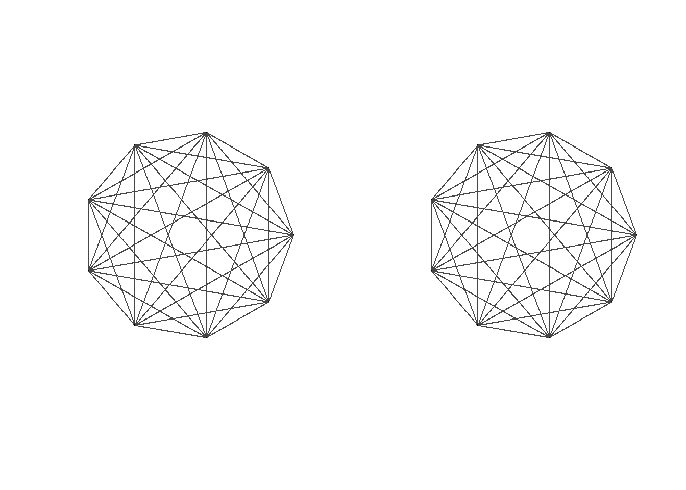


## Do birds of a feather flock together? {#1d}

- Assortativity 
	- `assortativity()` : calculate the assortativity based on specific attribute .The [assortativity coefficient](https://en.wikipedia.org/wiki/Assortativity) is positive is similar vertices (based on some external property) tend to connect to each, and negative otherwise.
	- `assortativity.degree()` : calculate the degree assortativity of the network .
- Reciprocity
	- `reciprocity()` : the [reciprocity](https://en.wikipedia.org/wiki/Reciprocity_(network_science)) of a **directed network** reflects the proportion of edges that are symmetrical.  

You can also do randomization test to these two metrics. 


```r
# Convert the gender attribute into a numeric value
values <- as.numeric(factor(V(g1)$gender))

# Calculate the assortativity of the network based on gender
assortativity(g1, values)
## [1] 0.1319444

# Calculate the assortativity degree of the network
assortativity.degree(g1, directed = FALSE)
## [1] 0.4615385

# Calculate the reciprocity of the direct graph
reciprocity(g2)
## [1] 0
```


### Community detection {#1d1}

If a network is said to have a [community](https://en.wikipedia.org/wiki/Community_structure) structure then it is possible to assign vertices to **unique sets**. 
- `fastgreedy.community()` : a community detection method .
- `edge.betweenness.community()` : an alternative community detection method.
- `sizes()` : determine how many communities were detected and how many club members are in each.
- `membership()` : display which club members are in which community.
-  `disjoint_union()`: the union of two or more graphs are created. The graphs are assumed to have disjoint vertex sets.
Notice: 
- `x %du% y` is a simplified form of `disjoint_union(...)`, and this example is from igraph document.
- Because the division of this figure is so obvious, there is no difference between the two methods


```r
# Create a graph
g <- make_full_graph(5) %du% make_full_graph(5) %du% make_full_graph(5)

g <- add_edges(g, c(1,6, 1,11, 6, 11))

# make community detection
fc <- fastgreedy.community(g)
gc <- edge.betweenness.community(g)

# view metrics
sizes(fc)
## Community sizes
## 1 2 3 
## 5 5 5
membership(fc)
##  [1] 3 3 3 3 3 1 1 1 1 1 2 2 2 2 2
sizes(gc)
## Community sizes
## 1 2 3 
## 5 5 5

# Because this graph is
par(mfrow = c(1, 2)) 
plot(fc, g)
plot(gc, g)
```

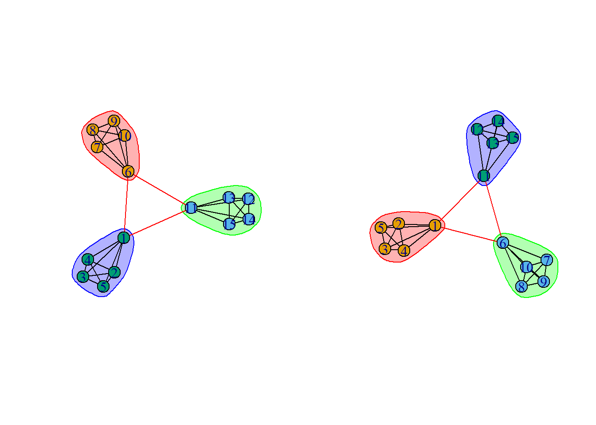


### Interactive network visualizations {#1d2}

There are many other R packages that also make network visualizations.

|        | |
|:-:|:-:|
| igraph          | visNetwork|
|statnet|networkD3|
|ggnet|sigma|
|ggnetwork|rgexf(igraph to Gephi)|
|ggraph|**threejs**|

The threejs package is especially useful for visualizing large networks and integrates very well with igraph. And you can use it to create interactive network visualization. 

<!-- But `graphjs` shows a blank probably threejs return a HTML, I don't know how to slove this problem.😥 -->


```r
graphjs(g1, vertex.size = 1)
```

```{=html}
<div id="0cxZ8nduqR" style="width:672px;height:480px;" class="scatterplotThree html-widget"></div>
<script type="application/json" data-for="0cxZ8nduqR">{"x":{"NROW":19,"height":null,"width":null,"axis":false,"numticks":[6,6,6],"xticklabs":null,"yticklabs":null,"zticklabs":null,"color":[["#24ADDB","#FFA500","#FFA500","#24ADDB","#24ADDB","#FFA500","#24ADDB","#FFA500","#24ADDB","#FFA500","#FFA500","#24ADDB","#24ADDB","#24ADDB","#24ADDB","#24ADDB","#24ADDB","#FFA500","#FFA500"]],"size":1,"stroke":"black","flipy":true,"grid":false,"renderer":"auto","signif":8,"bg":"white","cexsymbols":1,"xlim":[-1,1],"ylim":[-1,1],"zlim":[-1,1],"axisscale":[1,1,1],"pch":["@","@","@","@","@","@","@","@","@","@","@","@","@","@","@","@","@","@","@"],"elementId":"0cxZ8nduqR","from":[[0,0,0,1,2,3,3,3,4,4,4,5,6,6,7,7,8,9,10,10,11,11,12,12,13]],"to":[[3,4,6,2,5,6,14,7,6,7,8,14,7,8,8,9,15,10,11,16,16,17,13,18,18]],"lwd":1,"linealpha":1,"center":true,"main":[""],"options":true,"alpha":[[1,1,1,1,1,1,1,1,1,1,1,1,1,1,1,1,1,1,1]],"vertices":[[0.56983965,0.084372653,-1,0.71230604,0.88448402,1,0.91138138,0.9419612,0.60982995,0.54867956,0.3745559,-0.67488234,0.051740489,-0.12910649,-0.91515861,1,1,0.13104307,0.35270086,-0.065913778,-0.69576035,-0.051889141,0.1451166,-0.60468194,-0.050286653,-0.48025124,-0.62554044,-0.4694636,0.54085171,-0.2772825,-0.75738044,0.59566204,0.20104869,-0.7977564,0.36171049,0.61217487,0.47084931,-0.88126157,0.70021477,0.87141259,-0.82075064,0.75777591,0.84247061,0.88068405,-0.35003304,-0.24038763,-1,-0.41933336,-1,0.7206328,0.46814111,-0.69292629,-0.09383891,0.87294397,0.80226183,-0.91884452,0.45135272]],"xticklab":["-1.00","-0.60","-0.20","0.20","0.60","1.00"],"yticklab":["-1.00","-0.60","-0.20","0.20","0.60","1.00"],"zticklab":["1.00","0.60","0.20","-0.20","-0.60","-1.00"],"xtick":[0,0.2,0.4,0.6,0.8,1],"ytick":[0,0.2,0.4,0.6,0.8,1],"ztick":[0,0.2,0.4,0.6,0.8,1],"axislength":[1,1,1]},"evals":[],"jsHooks":[]}</script>
```

```r
# Another unrelated but unprecedented operation that I have not encountered before
i <-  membership(fc)
c("yellow", "blue", "red")[i]
```

```
##  [1] "red"    "red"    "red"    "red"    "red"    "yellow" "yellow" "yellow"
##  [9] "yellow" "yellow" "blue"   "blue"   "blue"   "blue"   "blue"
```


